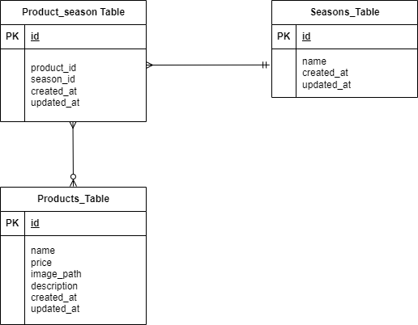

# アプリケーション名
もぎたて
hm-kadai2

## 環境構築
Docker ビルド
1. git clone git@github.com:hmgit-git/hm-kadai2.git
2. docker-compose up -d --build
3. srcディレクトリにある「.env.example」をコピーして「.env」を作成し  DBの設定を変更
4. phpコンテナにログイン
docker-compose exec php bash
5. laravelのインストール
composer install
6. アプリケーションキーを作成
php artisan key:generate
7. DBのテーブルを作成
php artisan migrate
8. DBのテーブルにダミーデータを投入
php artisan db:seed
9. シンボリックリンクを作成
php artisan storage:link
10. "The stream or file could not be opened"エラーが発生した場合
srcディレクトリにあるstorageディレクトリに権限を設定
chmod -R 777 storage

## 使用技術(実行環境)
1. PHP 8.0
2. Laravel 10.0
3. MySQL 8.0

## URL
・商品一覧：http://localhost/products
・phpMyAdmin：http//localhost.8080/

## ER図

